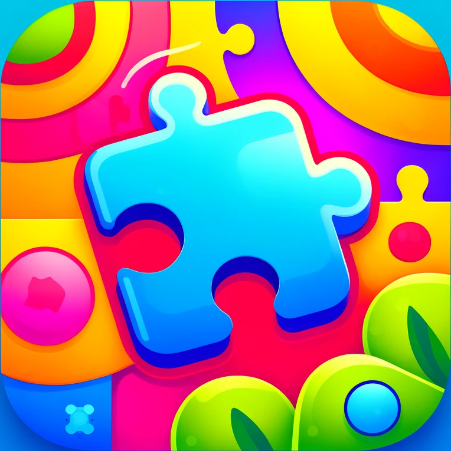

# Amazeing
> A simple maze game for iPad

This game is a tribute to a classic DOS-era maze game I played as a child which
could not be found anymore from the Internet.

AI assistance was heavily deployed to create the game.

## Getting started

Clone the repository and open the project in Unity and press "Build & Run".

## Contributing

If you'd like to contribute, please fork the repository and use a feature
branch. Pull requests are warmly welcome.

## Licensing

The code in this project is licensed under MIT license.
